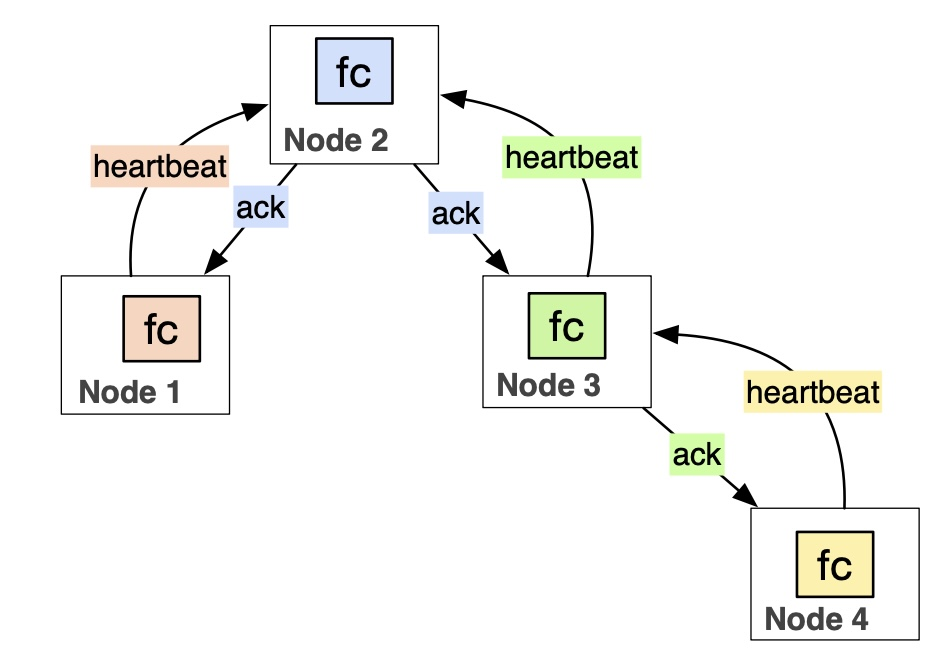

<!-- PROJECT LOGO -->
<br />
<p align="center">
 <a href="https://github.com/sassansh/Fcheck">
    
  </a>
  <h2 align="center">Fcheck Library</h2>

  <p align="center">
     A UDP-based failure checking (fcheck) library to detect server failure. Built and used in serveral assignments and projects in UBC's <a href="https://courses.students.ubc.ca/cs/courseschedule?pname=subjarea&tname=subj-course&dept=CPSC&course=416">CPSC 416</a> (Distributed Systems).
  </p>
</p>

<p align="center">
    
</p>

## Table of Contents

- [Goals 🎯](#goals-)
- [Technology Stack 🛠️](#technology-stack-)
- [Prerequisites 🍪](#prerequisites-)
- [Setup 🔧](#setup-)

## Goals 🎯

The fcheck library is used for failure detection. The basic idea of the fcheck library is that it can be imported and used by code in one node to detect if another node, that is also using the fcheck library, has failed or not. The fcheck library uses a simple heartbeat-ack protocol. fcheck is application-independent, and can be used in any system.

In the fcheck library a node may optionally monitor one or more nodes and also allow itself to be monitored by any number of other nodes. Monitoring means that the monitoring node actively sends heartbeat messages (a type of UDP message defined below) to check if the node being monitored has failed, or not. Upon receiving a heartbeat, fcheck responds to the sender with an ack message. Failure is determined/defined based on some number of heartbeats that have not been acked.

## Technology Stack 🛠️

[Go](https://go.dev)

## Prerequisites 🍪

You should have [GoLand](https://www.jetbrains.com/go/download/), [Go v1.18.1](https://go.dev/dl/) and [Git](https://git-scm.com/) installed on your PC.

## Setup 🔧

1. Clone the repo using:

   ```bash
     git clone https://github.com/sassansh/Fcheck.git
   ```

2. Open the project in GoLand.

3. To start the first server, run:

   ```bash
     go run cmd/server1/main.go
   ```

4. Quickly after, start the second server so they can monitor each other:

   ```bash
     go run cmd/server2/main.go
   ```

5. Kill one process and watch the other one notify you of the failure.
